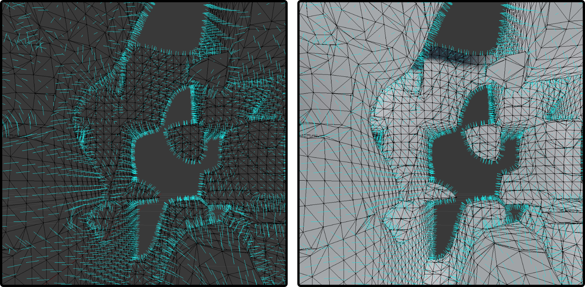

# Marching Cubes on Perlin Noise
A simple 3D perlin noise generator. It can be used to sample points at a given isolevel and to obtain a solid mesh by using the marching cubes algorithm. The results can be viewed in the provided OpenGL Viewer or exported as an OBJ Wavefront file and rendered in software such as Blender.

Figure: Screenshot from Blender Import, visualizing the pointcloud, the triangulation and calculated normals.
